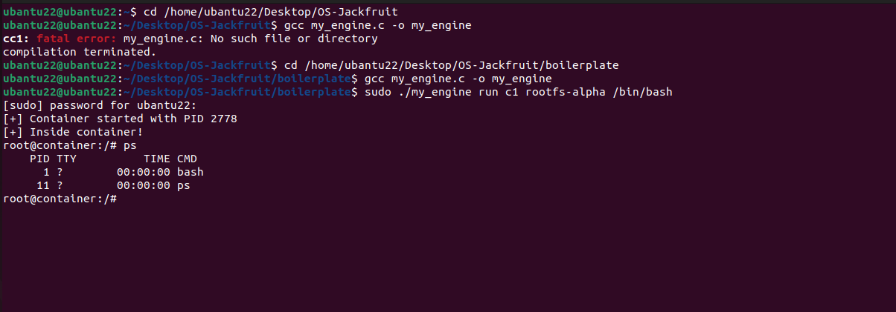
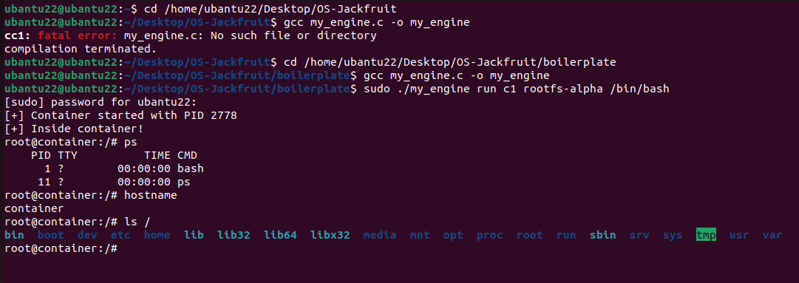
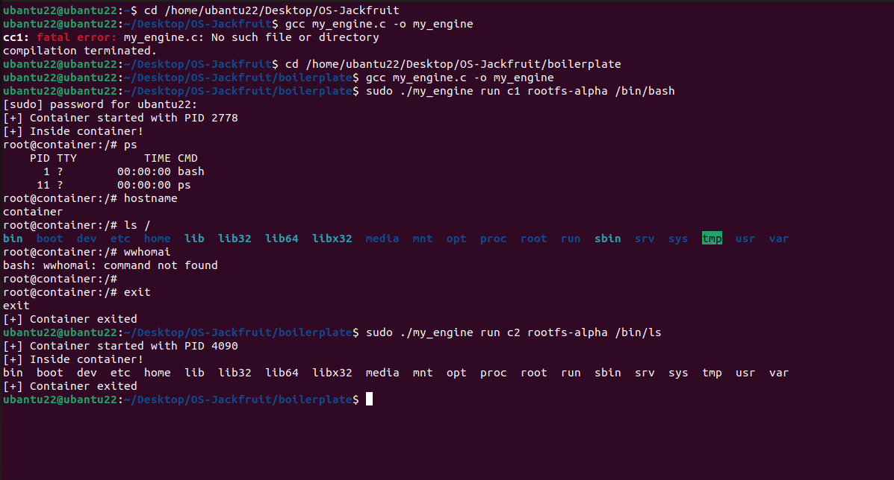

# OS Jackfruit – Mini Container Runtime

## 1. Team Information

| Name          | SRN           |
| ------------- | ------------- |
| Rahul Bellary | PES1UG24CS357 |
| Pranav S S    | PES1UG24CS336 |

---

## 2. Build and Run Instructions

### Prerequisites

```bash
sudo apt update
sudo apt install build-essential
```

---

### Compile

```bash
cd boilerplate
gcc my_engine.c -o my_engine
```

---

### Run Container

```bash
sudo ./my_engine run c1 rootfs-alpha /bin/bash
```

---

### Inside Container

```bash
ps
hostname
ls /
```

---

### Run Command

```bash
sudo ./my_engine run c2 rootfs-alpha /bin/ls
```

---

## 3. Demo Screenshots

### Process Isolation



### Hostname Isolation



### Filesystem Isolation


### Full Execution



---

## 4. Engineering Analysis

### 4.1 Isolation Mechanisms

This container runtime achieves isolation using Linux namespaces and chroot.

* **CLONE_NEWPID (PID Namespace)**
  Provides process isolation. Inside the container, the first process runs as PID 1 and cannot see host processes.

* **CLONE_NEWUTS (UTS Namespace)**
  Allows the container to have its own hostname using `sethostname()`, ensuring identity isolation.

* **CLONE_NEWNS (Mount Namespace)**
  Provides an isolated view of mount points. The `/proc` filesystem is mounted separately inside the container.

* **chroot()**
  Restricts the container’s filesystem to the specified root directory (`rootfs-alpha`), preventing access to host files.

---

### 4.2 Container Execution Flow

The execution flow of the container is:

1. The parent process calls `clone()` with namespace flags
2. A new child process is created with isolated namespaces
3. The child sets hostname using `sethostname()`
4. Filesystem root is changed using `chroot()`
5. `/proc` filesystem is mounted inside the container
6. The command is executed using `execvp()`

---

### 4.3 Observations

* `ps` shows only container processes → confirms PID isolation
* `hostname` outputs **container** → confirms UTS isolation
* `ls /` shows isolated filesystem → confirms filesystem isolation
* Commands execute independently from the host system

---

## 5. Design Decisions

* Used `chroot()` instead of `pivot_root` for simplicity and ease of implementation
* Focused on core namespace-based isolation concepts
* Designed a minimal container runtime rather than a full Docker-like system
* Prioritized clarity and correctness over complexity

---

## 6. Limitations

* No resource control (no CPU or memory limits using cgroups)
* No networking namespace implemented
* Not fully secure compared to production container systems
* Limited to basic container functionality

---

## 7. Conclusion

This project successfully demonstrates the fundamental concepts of containerization using Linux namespaces.

It provides process isolation, hostname separation, and filesystem isolation, giving practical insight into how container technologies like Docker work internally.
